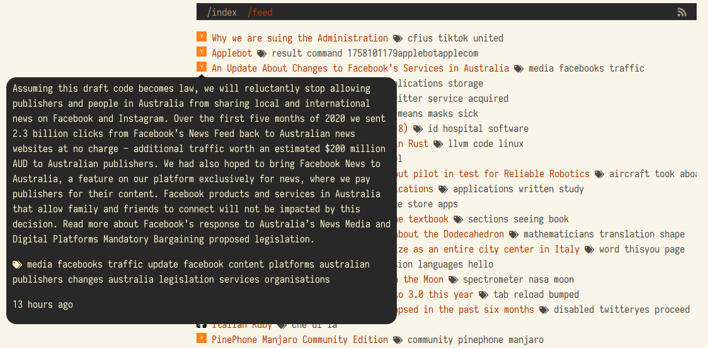

# Flask news reader



* [Traefik](https://traefik.io) reverse proxy
* Flask web application deployed with nginx and uWSGI using [uwsgi-nginx-flask-docker](https://github.com/tiangolo/uwsgi-nginx-flask-docker) container
* Auxiliary [script](./feeds/observer) that parses the sites and summarizes articles using [NTLK](http://https://www.nltk.org) module
* Postgres and redis for data storage.

## Setup

### Development
```bash
virtualenv venv --python=/usr/bin/python3 && source venv/bin/activate
pip3 install -r requirements.txt
pip3 install -r requirements-dev.txt

docker-compose up -d postgres redis

# Optional: PostgreSQL web interface on http://localhost:5050
docker-compose up -d pgadmin

# Setup dependencies and initialize DB if this is required
PG_URI=localhost python3 deploy/setup_dependencies.py

# Perform DB migrations
alembic revision --autogenerate -m 'Init'
alembic upgrade head

# Run without containers
DEBUG=1 PG_URI=localhost REDIS_HOST=localhost py3 main.py --observer=1
DEBUG=1 PG_URI=localhost REDIS_HOST=localhost py3 main.py --web=1
```

### Production
```bash
sudo deploy/mkswap.sh  # required for low-ram host
docker network create idie_external_network
docker-compose build
POSTGRES_USER='xxx' POSTGRES_PASSWORD='xxx' docker-compose up -d
```
